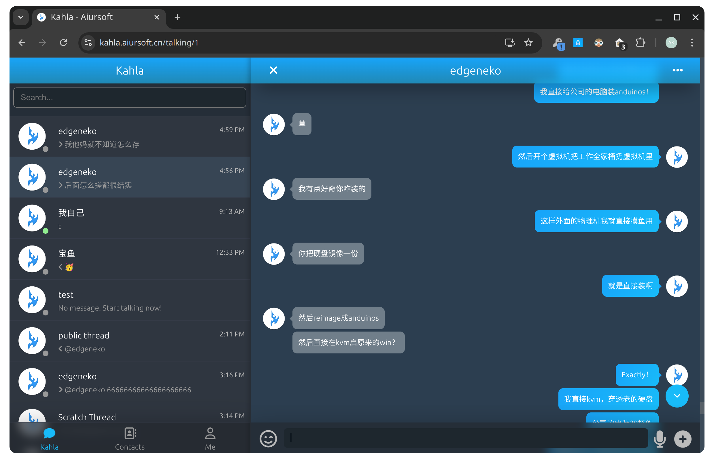

# Kahla

[](https://gitlab.aiursoft.com/aiursoft/kahla/-/blob/master/LICENSE)
[](https://gitlab.aiursoft.com/aiursoft/kahla/-/pipelines)
[](https://gitlab.aiursoft.com/aiursoft/kahla/-/pipelines)
[](https://www.nuget.org/packages/Aiursoft.Kahla.Sdk/)
[](https://manhours.aiursoft.com/r/gitlab.aiursoft.com/aiursoft/kahla.html)
[](https://kahla.aiursoft.com)
[](https://hub.docker.com/r/aiursoft/kahla)

Kahla is a cross-platform business chat application. It is written in C# and TypeScript. It uses ASP.NET Core and Angular. It is a part of the Aiursoft project.




## Try

Try a running Kahla [here](https://kahla.aiursoft.com).

## Run manually

Requirements about how to run

1. Install [.NET 10 SDK](http://dot.net/) and [Node.js](https://nodejs.org/).
2. Execute `yarn install && yarn run build` at `./src/Aiursoft.Kahla.Frontend/` folder to install the dependencies.
3. Copy the `dist` content to `./src/Aiursoft.Kahla.Server/wwwroot/`.
4. Execute `dotnet run` to run the app.
5. Use your browser to view [http://localhost:5000](http://localhost:5000).

## Run in Microsoft Visual Studio

1. Open the `.sln` file in the project path.
2. Press `F5` to run the app.

## Run in Docker

First, install Docker [here](https://docs.docker.com/get-docker/).

Then run the following commands in a Linux shell:

```bash
image=aiursoft/kahla
appName=kahla
docker pull $image
docker run -d --name $appName --restart unless-stopped -p 5000:5000 -v /var/www/$appName:/data $image
```

That will start a web server at `http://localhost:5000` and you can test the app.

The docker image has the following context:

| Properties  | Value                           |
|-------------|---------------------------------|
| Image       | aiursoft/kahla                  |
| Ports       | 5000                            |
| Binary path | /app                            |
| Data path   | /data                           |
| Config path | /data/appsettings.json          |

## How to contribute

There are many ways to contribute to the project: logging bugs, submitting pull requests, reporting issues, and creating suggestions.

Even if you with push rights on the repository, you should create a personal fork and create feature branches there when you need them. This keeps the main repository clean and your workflow cruft out of sight.

We're also interested in your feedback on the future of this project. You can submit a suggestion or feature request through the issue tracker. To make this process more effective, we're asking that these include more information to help define them more clearly.
