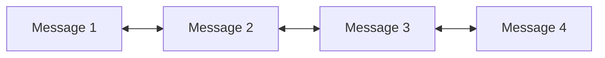

# Kahla Message Synchronization Algorithm

Kahla uses a sophisticated "Double Pointer" model to handle message synchronization between the client and the server. This model ensures that messages are delivered reliably, in order, and allows for optimistic UI updates where local messages are displayed immediately before being confirmed by the server.

This algorithm is implemented in both:
- **TypeScript**: `src/Aiursoft.Kahla.Frontend/kahla.sdk/src/KahlaMessagesMemoryStore.ts`
- **C#**: `src/Aiursoft.Kahla.SDK/Services/KahlaMessagesMemoryStore.cs`

## Core Concept: The Linked List

The core data structure is a **Doubly Linked List** containing `Commit<ChatMessage>` objects.
Each commit represents a message action and has a unique ID.

## The Two Pointers

The synchronization state is managed by two pointers (references to nodes in the linked list):

1.  **LastPulled**: Points to the last message that has been successfully **received from the server** (or confirmed by the server).
2.  **LastPushed**: Points to the last message that has been successfully **sent to the server**.

Associated with these pointers are integer offsets (`PulledItemsOffset` and `PushedItemsOffset`) used to request specific message ranges from the API.

## Workflows

### 1. Sending a Message (Local Commit)

When a user sends a message:
1.  A new `Commit` is created with a unique ID.
2.  It is added to the **end** of the Linked List.
3.  The UI updates immediately to show this new message (Optimistic UI).
4.  `LastPushed` does **not** move yet. It still points to the previous "sent" message.

### 2. Pushing to Server (Sync Up)

To send pending messages to the server:
1.  The `Push()` method iterates starting from the node *after* `LastPushed`.
2.  It sends these messages to the server (e.g., via WebSocket).
3.  As it iterates, it advances the `LastPushed` pointer to the current message, marking it as "attempted to push".

### 3. Pulling from Server (Sync Down)

When a new message arrives from the server (pushed via WebSocket or pulled via API):

The algorithm checks where this new message fits relative to our local state (`LastPulled`).

**Case A: Confirmation of Local Message**
If the incoming message's ID matches the ID of the node *immediately following* `LastPulled`:
- This means our local speculative message was confirmed by the server.
- We simply advance `LastPulled` to this next node.

**Case B: New Message (from others)**
If the incoming message's ID does *not* match the next local node (or if there is no next node):
- This is a new message from someone else (or a reordered event).
- We insert this new message **immediately after** `LastPulled`.
- `LastPulled` is advanced to this new node.
- Effectively, this inserts the new message *before* any of our pending local messages that haven't been confirmed yet.

### Pointer Adjustment Logic

After processing an incoming message (`OnPulledMessage`), we must ensure `LastPushed` is consistent:

- If `LastPulled` has caught up to (or passed) `LastPushed` (meaning our local send was confirmed), `LastPushed` is updated to equal `LastPulled`.
- If we inserted a *new* item (Case B) *before* our pending messages, we increment `PushedItemsOffset` because our pending messages effectively shifted index by +1.

## Benefits

1.  **Optimistic UI**: Users see their messages instantly.
2.  **Automatic Re-ordering**: If you send a message, but someone else sent one slightly before you that reaches the server first, the server will send that message down. Your client will insert it *before* your pending message, maintaining the correct global order defined by the server.
3.  **Resiliency**: If the connection drops, the `offset` integers allow the client to request exactly what it missed upon reconnection.
